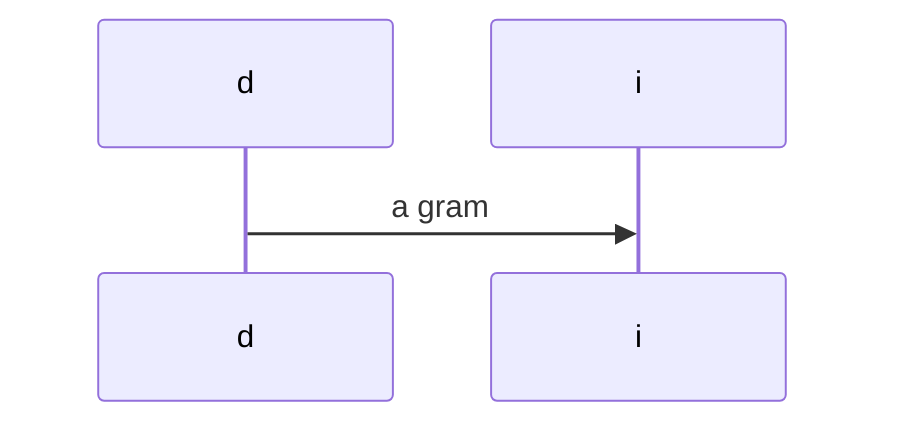

# foo

A `inline code` with inline math $x(f) = \sum_{i=1}^{\inf} 1+i$ for $\omega$ space.



and now dollar in code

```markdown
$codeagain!$

$$
not_math_again2
$$
```

```rust
/// Comment
fn sample_rust_code<T: Y>() -> Result<T> {
  // dev
  (<Y as T>::booboo()?)
}
```

and finally some math:

$$equ,oink
y = \sum somath
$$

Now ref that one block equ $ref:equ:oink$.
