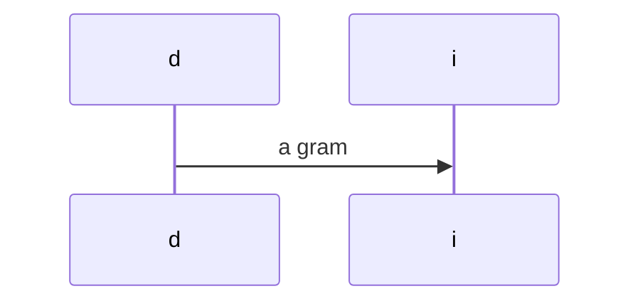

# foo

A `inline code` with inline math $x(f) = \sum_{i=1}^{\inf} 1+i$ for $\omega$ space.



and now dollar in code

```md
$codeagain!$

$$
not_math_again2
$$
```

and finally some math:

$$oink
y = \sum socode
$$

Now ref that one block equ $ref:oink$.
