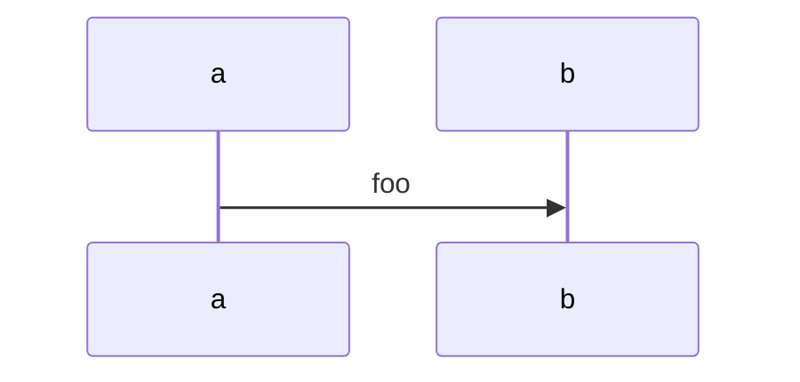

# foo

A `inline code` with inline math $x(f) = \sum_{i=1}^{\inf} 1+i$ for $\omega$ space.

Now code with dollar `$` mixed with math $x$ and block equation as code`$$notcode!$$`.

An equation block

$$oink
y = \sum x
$$

followed by a code block



and now dollar in code

```md
$notmathagain!$

$$
notmathagain2
$$
```

Now ref that one block equ $ref:oink$.
